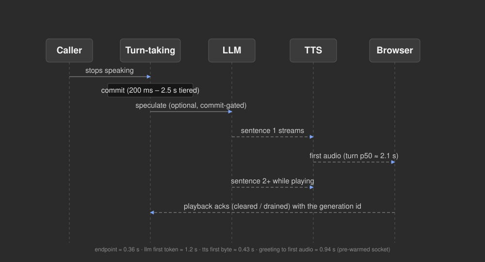
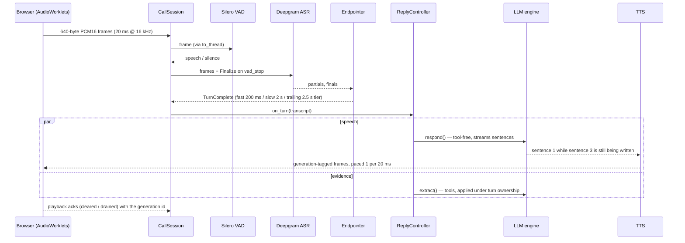

# Screener — a from-scratch voice screening agent

A production-shaped voice AI screener built with **no voice platform and no agent
framework**: every stage is a raw protocol you can read in one file.

```
browser mic ─▶ WebSocket ─▶ Silero VAD ─▶ Deepgram streaming ASR ─▶ custom endpointer
        ─▶ objective-driven LLM engine (OpenAI Responses API, raw SSE)
        ─▶ streaming TTS (Deepgram Aura or ElevenLabs) ─▶ paced audio back to the caller
```

It handles barge-in, measures every stage of every turn, re-extracts evidence after
the call, and scores deterministically from caller-verified quotes only. The same
pipeline answers phone calls through a Twilio Media Streams adapter.



## Quick start

```bash
python -m venv .venv && source .venv/bin/activate   # Windows: .venv\Scripts\activate
pip install -r requirements.txt
cp .env.example .env                                 # then fill in the keys below
uvicorn server.app:app --reload --port 8080
# open http://localhost:8080 — the console; use headphones (echo becomes barge-in)
```

Or in a container:

```bash
docker compose up --build                            # reads .env, serves :8080
```

### Keys

| Vendor | Used for | Notes |
|---|---|---|
| `DEEPGRAM_API_KEY` | streaming ASR (nova-3 / Flux) **and** Aura-2 TTS | one key, both directions |
| `OPENAI_API_KEY` | the turn engine (`gpt-5.6-luna`) and post-call extraction | `TURN_MODEL` is config, not code — it was benchmarked |
| `ELEVENLABS_API_KEY` | optional alternative TTS (`TTS_PROVIDER=elevenlabs`) | an exhausted quota **fails silently** (contexts finalize with zero audio, no error); the server raises `TtsNoAudio` on that instead of shipping a silent call |

`TTS_PROVIDER=aura` (default in `.env.example`) needs only the Deepgram key.

## How a turn works



Barge-in: local VAD arms only once the caller can actually hear audio; an
interruption invalidates the generation *before* cancelling it, the browser reports
how many samples it played, and the transcript keeps exactly the spoken prefix.

## Module map

| Area | Files | What to read them for |
|---|---|---|
| Transport | `server/realtime/transport.py`, `twilio.py`, `client_events.py`, `static/*-processor.js` | the frame contract (640 B = 20 ms), G.711 codecs, the Twilio adapter, browser control messages, the worklets |
| Turn-taking | `vad.py`, `asr.py`, `flux.py`, `endpoint.py`, `events.py` | Silero v5 (64-sample context!), Deepgram v1 and Flux protocols, the three-tier endpointer, priority event buffer |
| Replies | `reply.py`, `supervisor.py`, `speaker.py`, `speculation.py`, `extraction.py`, `bargein.py` | generation supervision, paced sending with sentence marks, commit-gated drafts, evidence beside speech |
| TTS | `tts.py` (ElevenLabs multi-context), `tts_aura.py` (Deepgram speak socket + warm-socket cache) | two raw protocols behind one `synthesize()` |
| Engine | `server/engine/turn.py`, `stream.py`, `prompt.py`, `evidence.py`, `plan.py`, `intents.py` | Responses-API SSE assembly, prompts, the evidence gate, plan-as-data |
| Post-call | `server/postcall/extract.py`, `score.py`, `analyze.py`, `report.py`, `report_view.py` + `templates/` | quote-verified extraction, deterministic scoring, advisory notes, the report |

Every module starts with a **"How this works"** header. The interview itself is
data: `plans/icu_nurse.yaml` holds objectives, boundaries, scoring and analyses —
no question text lives in code or prompts.

## Measured results

Same simulated call, same code, two places it ran — live vendors both times. The
deployed instance sits in `iad` next to the speech and LLM vendors; the laptop
paid the server-to-vendor round trips on every stage.

| Metric | Deployed on Fly (`iad`) | Developer laptop |
|---|---|---|
| endpoint_delay p50 (vad stop → commit) | **209 ms** | ~350 ms |
| llm_ttft p50 (commit → first token) | **812 ms** | ~1.2–1.5 s |
| tts_ttfb p50 (sentence → first audio byte) | **46 ms** | ~450 ms |
| **turn_latency p50 (vad stop → first audio frame)** | **1252 ms** | ~2.1–2.7 s |
| greeting → first audio | — | 2735 → **942 ms** with the TTS socket pre-opened (paired A/B, 4/4) |
| first turn's API handshake | — | 1498 → **838 ms** by warming during the greeting (paired, n=10, 10/10) |
| browser loopback RTT | — | ~1 ms, 670 frames |

Try it: `SCREENER_SERVER=<host> python scripts/simulate_caller.py` runs the gate
against any deployment and `/metrics` reports the per-stage percentiles.

What was measured and **not** adopted, because the numbers said no:

- **Pre-final speculation** in custom mode: 0 of 10 drafts promoted — Deepgram only
  punctuates on the final, so no reliable end-of-turn signal exists before it. It
  pays only in Flux mode, where `EagerEndOfTurn` arrives ahead of the final.
- **Prompt caching**: `cached_tokens` stays 0 — the stable prefix is under the
  provider's threshold and the sliding history window changes it every few turns.
- **A smaller model**: `gpt-4o-mini` was slower to first token than `gpt-5.6-luna`.
- **Provider priority tier**: 1294 → 713 ms on a toy prompt, a wash on the real
  ~1000-token prompt (993 → 872 ms median, identical means). Shipped as an opt-in.
- **Concurrent evidence extraction** slowing speech: +12 ms, noise (paired, n=12).

## Verification

- `pytest -q` — **329 offline tests**, no vendor calls. The browser capture worklet
  runs as real JavaScript under Node (`tests/capture_harness.js`) because the
  simulator can never reach it — a mic regression once shipped while every Python
  test stayed green.
- `ruff check .` and `docker build .` — both run in CI on every push.
- `python scripts/simulate_caller.py [--flux | --twilio]` — the live gate: a
  synthesized rambling caller with mid-thought pauses asserts turn integrity,
  extraction, **and that agent audio actually arrived**. `--protocol-self-test`
  checks the wire format offline.
  `SCREENER_SERVER=<host>` runs the same gate against a deployment over wss/https.

## Two turn-taking stacks

The console's **Flux** toggle switches a call between the custom VAD-anchored
endpointer and Deepgram Flux's model end-of-turn. Metrics are tagged per mode so the
A/B reads side by side in the report. Flux's `EagerEndOfTurn` is the only mechanism
that can hide LLM latency (it signals before the final transcript); the custom stack
commits faster.

## Telephony

The phone leg is a **transport adapter, not a second pipeline**: Twilio Media
Streams connect to `/ws/twilio`, `TwilioSocket` transcodes 8 kHz μ-law to the
internal 16 kHz frames and back, maps Twilio `mark`/`clear` onto the browser's
playback-ack protocol, and `CallSession` never learns which leg it is on.

```bash
ngrok http 8080                                   # locally; or deploy (below) for a stable origin
# .env: PUBLIC_BASE_URL=https://<id>.ngrok.app  TWILIO_ACCOUNT_SID=…  TWILIO_AUTH_TOKEN=…  TWILIO_FROM_NUMBER=+1…
python scripts/place_call.py +15551234567         # outbound; or point a number's voice webhook at /twilio/voice
python scripts/simulate_caller.py --twilio        # the same live gate over the phone protocol, no Twilio account needed
```

`/twilio/voice` verifies `X-Twilio-Signature` when an auth token is configured.
Narrowband audio changes what the ASR hears: the phone-leg simulator caught the
endpointer fast-committing on a punctuated fragment ("I mean, if.") that the
browser leg never produced, and the fix lives in `endpoint.py`.

## Deploy

[](https://render.com/deploy?repo=https://github.com/yihalem123/end-to-end-vocieAI)

Free tier: `render.yaml` defines the service (Docker, free plan, `/healthz` check) and
prompts you for the two API keys. Free instances spin down after 15 idle minutes and
take about a minute to wake, so open the URL a minute before a demo.

The image is a single uvicorn process (`Dockerfile`): metrics and reports are
in-memory and per process, so scale by machines, not workers.

```bash
docker build -t screener . && docker run --env-file .env -p 8080:8080 screener
```

Fly.io (`fly.toml` is included; the app needs a public HTTPS/WSS origin for Twilio).
Deployed in `iad`, next to the speech and LLM vendors, the same simulated call measured
**turn latency p50 1252 ms** (endpoint 209 · llm first token 812 · tts first byte 46)
against ~2.1–2.7 s from a developer laptop: the server-to-vendor round trips were the
hidden cost, so region matters more than provider.

```bash
fly launch --no-deploy --copy-config          # pick a name and region
fly secrets set DEEPGRAM_API_KEY=… OPENAI_API_KEY=… PUBLIC_BASE_URL=https://<app>.fly.dev
fly deploy
```

`--proxy-headers` is on in the image so the TwiML handed to Twilio carries `wss://`
behind a TLS-terminating proxy. Any host that runs a container and passes
WebSockets through works the same way (Render, Railway, a VM with Caddy).

## Deliberately out of scope

Authenticated sessions and durable persistence: the report store and the metrics
registry are in-process. The interfaces are where a database would attach.

## License

MIT — see `LICENSE`. The bundled `models/silero_vad.onnx` is Silero VAD, MIT-licensed
by its authors.
