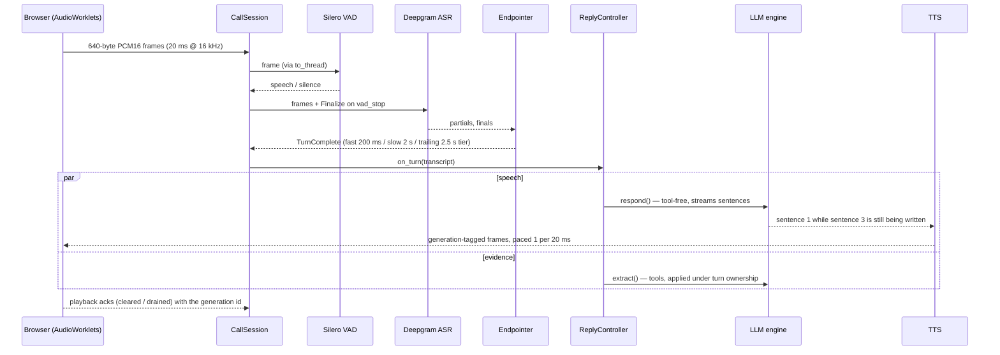

# Screener — a from-scratch voice screening agent

A production-shaped voice AI screener built with **no voice platform and no agent
framework**: every stage is a raw protocol you can read in one file.

```
browser mic ─▶ WebSocket ─▶ Silero VAD ─▶ Deepgram streaming ASR ─▶ custom endpointer
        ─▶ objective-driven LLM engine (OpenAI Responses API, raw SSE)
        ─▶ streaming TTS (Deepgram Aura or ElevenLabs) ─▶ paced audio back to the caller
```

It handles barge-in, measures every stage of every turn, re-extracts evidence after
the call, and scores deterministically from caller-verified quotes only. The point
of the project is ownership of the whole real-time loop, with the measurements to
defend each decision — including the ones that didn't pay off.

## Quick start

```bash
python -m venv .venv && source .venv/bin/activate   # Windows: .venv\Scripts\activate
pip install -r requirements.txt
cp .env.example .env                                 # then fill in the keys below
uvicorn server.app:app --reload --port 8080
# open http://localhost:8080 — the console; use headphones (echo becomes barge-in)
```

### Keys

| Vendor | Used for | Notes |
|---|---|---|
| `DEEPGRAM_API_KEY` | streaming ASR (nova-3 / Flux) **and** Aura-2 TTS | one key, both directions; the signup credit covers this project many times over |
| `OPENAI_API_KEY` | the turn engine (`gpt-5.6-luna`) and post-call extraction | `TURN_MODEL` is config, not code — it was benchmarked |
| `ELEVENLABS_API_KEY` | optional alternative TTS (`TTS_PROVIDER=elevenlabs`) | the free tier **fails silently** when exhausted: contexts finalize with zero audio and no error. The server now raises on that; see REHEARSAL.md war story 10 |

`TTS_PROVIDER=aura` (default in `.env.example`) needs only the Deepgram key.

## How a turn works



Barge-in: local VAD arms only once the caller can actually hear audio; an
interruption invalidates the generation *before* cancelling it, the browser reports
how many samples it played, and the transcript keeps exactly the spoken prefix.

## Module map

| Area | Files | What to read them for |
|---|---|---|
| Transport | `server/realtime/transport.py`, `client_events.py`, `static/*-processor.js` | the frame contract (640 B = 20 ms); browser control messages; the worklets |
| Turn-taking | `vad.py`, `asr.py`, `flux.py`, `endpoint.py`, `events.py` | Silero v5 (64-sample context!), Deepgram v1 and Flux protocols, the three-tier endpointer, priority event buffer |
| Replies | `reply.py`, `supervisor.py`, `speaker.py`, `speculation.py`, `extraction.py`, `bargein.py` | generation supervision, paced sending with sentence marks, commit-gated drafts, evidence beside speech |
| TTS | `tts.py` (ElevenLabs multi-context), `tts_aura.py` (Deepgram speak socket + warm-socket cache) | two raw protocols behind one `synthesize()` |
| Engine | `server/engine/turn.py`, `stream.py`, `prompt.py`, `evidence.py`, `plan.py`, `intents.py` | Responses-API SSE assembly, prompts, the evidence gate, plan-as-data |
| Post-call | `server/postcall/extract.py`, `score.py`, `analyze.py`, `report.py`, `report_view.py` + `templates/` | quote-verified extraction, deterministic scoring, advisory notes, the report |

Every module starts with a **"How this works"** header. The interview itself is
data: `plans/icu_nurse.yaml` holds objectives, boundaries, scoring and analyses —
no question text lives in code or prompts.

## Measured results

All numbers were measured on this machine during the build; `REHEARSAL.md` has
the full card, provenance and history.

| Metric | Value | Context |
|---|---|---|
| endpoint_delay p50 | **365 ms** | custom endpointer, live, 14 turns |
| llm_ttft p50 | **1411 ms** | commit → first text token; the dominant stage (62%) |
| tts_ttfb p50 | 427 ms | Aura-2, warm socket |
| **turn_latency p50** | **2273 ms** | vad stop → first audio frame |
| greeting → first audio | 2735 → **942 ms** | pre-opened TTS socket (paired A/B, 4/4) |
| API connection warm | 1498 → **838 ms** first-token on turn 1 | paired A/B, n=10, 10/10 |
| browser loopback RTT | ~1 ms | 670 frames, localhost |

Measured **negative** results are recorded too — pre-final speculation (0/10 drafts
promoted), prompt caching (structurally blocked by the sliding history window), a
smaller model (slower), and a suspected extraction slowdown (+12 ms, noise). They
are in `REHEARSAL.md` under *Measured negative results*.

## Verification

- `pytest -q` — **327 offline tests**, no vendor calls. The browser capture worklet
  runs as real JavaScript under Node (`tests/capture_harness.js`) because the
  simulator can never reach it — a mic regression once shipped while every Python
  test stayed green.
- `ruff check .` — configured in `pyproject.toml`; both run in CI on every push.
- `python scripts/simulate_caller.py [--flux | --twilio]` — the live gate: a synthesized rambling
  caller with mid-thought pauses asserts turn integrity, extraction, **and that agent
  audio actually arrived**. `--protocol-self-test` checks the wire format offline.

## Two turn-taking stacks

The console's **Flux** toggle switches a call between the custom VAD-anchored
endpointer and Deepgram Flux's model end-of-turn. Metrics are tagged per mode so the
A/B reads side by side in the report. Flux's `EagerEndOfTurn` is the only mechanism
that can hide LLM latency (it signals before the final transcript); the custom stack
commits faster. Both are measured in `REHEARSAL.md`.

## Telephony

The phone leg is a **transport adapter, not a second pipeline**: Twilio Media
Streams connect to `/ws/twilio`, `TwilioSocket` transcodes 8 kHz μ-law to the
internal 16 kHz frames and back, maps Twilio `mark`/`clear` onto the browser's
playback-ack protocol, and `CallSession` never learns which leg it is on.

```bash
ngrok http 8080                                   # or cloudflared; gives https://<id>.ngrok.app
# .env: PUBLIC_BASE_URL=https://<id>.ngrok.app  TWILIO_ACCOUNT_SID=…  TWILIO_AUTH_TOKEN=…  TWILIO_FROM_NUMBER=+1…
python scripts/place_call.py +15551234567         # outbound; or point a number's voice webhook at /twilio/voice
python scripts/simulate_caller.py --twilio        # the same live gate over the phone protocol, no Twilio account needed
```

`/twilio/voice` verifies `X-Twilio-Signature` when an auth token is configured.
Latency on the phone leg adds the carrier's own audio path on top of the numbers
above; that is the one stage this repo cannot measure without a real call.

## Deliberately out of scope

Authenticated sessions, durable persistence and containerized deployment were
scoped out on day one for a one-week build; the sequencing is in `PLAN.md` (kept
as history). `docs/reviews/` holds an external review of the repository and its
verified triage.

## License

MIT — see `LICENSE`. The bundled `models/silero_vad.onnx` is Silero VAD, MIT-licensed
by its authors.
